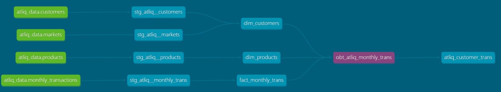

# Atliq Hardware Data Engineering Project using dbt and MySQL

This repository contains the code and resources used in my data engineering project for Atliq Hardware, a leading Indian computer peripherals manufacturer. The project focused on building a data warehouse, developing insightful reports (through the One Big Table), and automating tasks to empower business users with self-service capabilities.

## 1. Project Overview


This project leverages dbt (data build tool) and MySQL to create a robust and scalable data warehouse for Atliq Hardware.  The data warehouse is designed to provide business users with easy access to key metrics and insights derived from transactional data.  The project follows a modular approach, separating staging (raw data) and marts (transformed data) layers for maintainability and clarity.

## 2. Project Setup

### 2.1 Prerequisites

Before running this project, ensure you have the following software installed:

*   **dbt-core:**  The core dbt framework.
*   **dbt-mysql:** The dbt adapter for MySQL.
*   **MySQL:**  The database used for this project. The data for this project is located in the `data` folder (ensure the database is populated with this data).

### 2.2 Installation

1.  Install the required Python packages:

```bash
python -m pip install dbt-core dbt-mysql
```

## 3. Project Execution
### 3.1 Initialization and Configuration
Initialize a dbt project:
```bash
dbt init
```
Configure the MySQL connection in your .dbt/profiles.yml file. This file should contain your MySQL connection details (host, user, password, database). Example:
```YAML
atliq_hardware:
  target: dev
  outputs:
    dev:
      type: mysql
      host: <your_mysql_host>
      user: <your_mysql_user>
      password: <your_mysql_password>
      database: <your_mysql_database>
      port: 3306 # Or your MySQL port
```
Verify the connection:
```bash
dbt debug
```
### 3.2 Package Management
Create a packages.yml file to manage external dbt packages:
```YAML
packages:
  - package: dbt-labs/dbt_utils
    version: 1.3.0

  - package: dbt-labs/codegen
    version: 0.13.1
```
Install the packages:
```bash
dbt deps
```
### 3.3 Data Modeling
The project follows a two-layer approach:
- staging: Contains raw data models, prefixed with stg_.
- marts: Contains transformed and aggregated data models, designed for analysis.

#### 3.3.1 Staging Layer
Define data sources in models/_atliq_source.yml. This file declares the raw data tables and their schemas.

Generate base staging models using the codegen package:

```bash
dbt run-operation generate_base_model --args '{"source_name": "atliq_data", "table_name": "customers"}'
dbt run-operation generate_base_model --args '{"source_name": "atliq_data", "table_name": "markets"}'
dbt run-operation generate_base_model --args '{"source_name": "atliq_data", "table_name": "products"}'
dbt run-operation generate_base_model --args '{"source_name": "atliq_data", "table_name": "monthly_transactions"}'
```
Generate model YAML files for each staging model:
```bash
dbt run-operation generate_model_yaml --args '{"model_names": ["stg_atliq__customers"]}'
dbt run-operation generate_model_yaml --args '{"model_names": ["stg_atliq__markets"]}'
dbt run-operation generate_model_yaml --args '{"model_names": ["stg_atliq__monthly_trans"]}'
dbt run-operation generate_model_yaml --args '{"model_names": ["stg_atliq__products"]}'
```
#### 3.3.2 Marts Layer
Create SQL files in the models/marts directory to define the dimensional (dim_) and fact tables: dim_customers, dim_products, dim_markets, and fact_monthly_transaction.

Implement data quality tests within the respective model YAML files.  Include tests for uniqueness, not null constraints (especially for primary keys), and other relevant checks (e.g., not_negative for sold_quantity).  Example:

```YAML
models:
  - name: dim_customers
    columns:
      - name: customer_code
        tests:
          - not_null
          - unique
```
Create the "One Big Table" by joining the dimensional and fact tables. This table should be designed for reporting and analysis.

3.4 Data Transformations
Create macros in the macros folder to encapsulate data cleaning and transformation logic.  Examples include cleanstring, get_year_part, and get_month_part.

3.5 Testing
Implement custom data quality tests in the tests/generic/ directory.  For example, assert_stg_sold_quantity_is_positive.

3.6 Running the Project
Run the dbt project to build the data warehouse:

```bash
dbt run
```
